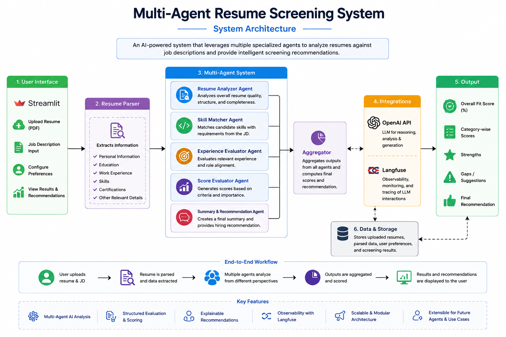

# Multi-Agent Resume Screening System

This repository contains the complete Multi-Agent Resume Screening System, developed as part of the TCS Assessment Framework. The system leverages an AI agent graph (using LangGraph) to deterministically parse, score, and evaluate candidates based on their resumes and the provided job description.

## Repository Architecture and Task Workflow

This project is organized into modular components that execute sequentially to process resumes, score candidates, and generate insights. Below is a detailed breakdown of each task and file within this repository.

### 1. Artificial Intelligence Agents (LangGraph Workflow)
The core logic resides in the `agents/` directory. The workflow operates as a state machine where a resume is processed through four distinct deterministic stages:

*   **Parser Node (`agents/nodes.py`)**: This task takes the raw text of a resume and processes it using a Large Language Model (LLM). It strictly maps the unstructured text into a validated Pydantic data schema (`CandidateProfile`), successfully extracting skills, experience, and education without systemic bias.
*   **Scoring Node (`agents/nodes.py`)**: This task evaluates the parsed candidate profile against the provided Job Description. The LLM acts as a technical recruiter to calculate a comprehensive alignment score ranging from 0 to 100.
*   **Ranking Node (`agents/nodes.py`)**: This task investigates the candidate's parsed timeline. It flags any temporal anomalies, such as significant employment gaps or overlapping roles, ensuring transparency in the candidate's career history.
*   **Interview Node (`agents/nodes.py`)**: As the final stage in the graph, this task synthesizes the candidate's skillset and flagged anomalies to dynamically generate 3 to 5 targeted, highly specific interview questions for the recruiting team.
*   **Graph Orchestration (`agents/graph.py`)**: This file constructs the LangGraph `StateGraph`, compiling the nodes mentioned above into a direct sequential pipeline (Parser -> Scorer -> Ranker -> Interviewer).

### 2. User Interface (Frontend Dashboard)
*   **Streamlit Application (`ui/app.py`)**: This file serves as the interactive web dashboard for recruiters. It allows users to drag-and-drop resume files, paste the target Job Description, and instantly visualize the parsed profile, alignment score, anomalies, and recommended interview questions.

### 3. File Parsing Utilities
*   **Document Parsers (`utils/parsers.py`)**: This component handles the extraction of raw text strings from diverse file formats, specifically `.pdf` and `.docx` files, preparing them for the downstream LLM processing.

### 4. System Evaluation and Metrics
*   **Statistical Evaluation (`evaluation/calculate_metrics.py`)**: This script executes a validation test against human reviewer baselines. It calculates the Pearson Correlation Coefficient ($r$) between human-assigned scores and the automated agent's scores to verify that the system accurately replicates expert human screening (target $r \ge 0.75$).

## Operational Setup

1.  **Clone the Repository**:
    ```bash
    git clone <your-repo-url>
    cd <your-repo-folder>
    ```

2.  **Install Dependencies**:
    ```bash
    pip install -r requirements.txt
    ```

3.  **Environment Variables**:
    Create a `.env` file in the root directory and add your required keys (refer to `.env.example`):
    ```
    OPENAI_API_KEY=your_openai_api_key_here
    LANGFUSE_PUBLIC_KEY=your_langfuse_public_key_here
    LANGFUSE_SECRET_KEY=your_langfuse_secret_key_here
    LANGFUSE_HOST=https://cloud.langfuse.com
    ```

4.  **Run the Streamlit Interface**:
    ```bash
    streamlit run ui/app.py
    ```

## Walkthrough Video

*(Please provide the link to your technical walkthrough video here)*
*   [Watch the system demonstration](https://youtube.com)
*   **What it covers**: Successful resume processing, triggered anomalies (e.g., severe career gaps), and the corresponding Langfuse execution traces.

## System Architecture

The Multi-Agent Resume Screening System uses multiple AI agents to evaluate resumes against a given job description. The architecture below illustrates the overall workflow of the application.


